# Adversarial Analysis and Multi-Agent Adjudication

## A practical guide to panels, debates, critics, judges, evidence, disagreement, and controlled decisions

- **Status:** publication draft
- **Scope:** epistemic and operational decisions made with one or more AI agents
- **Reference workflow:** Adversarial Decision Flow v1.0
- **Last reviewed:** September 4, 2026

> **Spanish executive edition:** [Análisis adversarial con inteligencia artificial](./RESUMEN-EJECUTIVO-ES.md)

## 1. The central idea

An adversarial system is not simply “several models giving opinions.” It is a
protocol that deliberately produces useful disagreement, tests that disagreement
against evidence, and converts the surviving claims into a controlled decision.

This distinction matters. Adding more agents can increase diversity, but it can also
multiply the same error, create persuasive noise, increase cost, and conceal who is
actually authorized to decide. A robust design therefore separates at least seven
functions:

1. generating candidate answers or plans;
2. attacking assumptions and searching for failures;
3. defending viable alternatives;
4. verifying factual or executable claims;
5. classifying the kind of disagreement;
6. adjudicating among the surviving positions;
7. authorizing, executing, and verifying the real-world effect.

The shortest useful definition is:

> **Multi-agent adjudication transforms competing proposals into a coordinated,
> justified, executable, and auditable decision.**

The final decision can be represented conceptually as:

```text
d = A(P, E, C, R)
```

where:

- `P` is the set of proposals and claims;
- `E` is the available evidence;
- `C` is the decision contract and its criteria;
- `R` is the authority, risk, and policy regime;
- `A` is the adjudication procedure;
- `d` is the decision record, not merely a prose answer.

The procedure is more important than the number of agents. One well-designed critic
plus deterministic tests can be more reliable than ten unstructured debaters.

## 2. What adjudication means

Two different problems are often called adjudication.

### Operational adjudication

Operational adjudication determines **who should do what**. It includes task
allocation, scheduling, resource assignment, auctions, negotiation, and delegation.
The classic Contract Net Protocol is an early and influential example: a manager
announces a task, potential contractors bid, and the manager awards the contract.

### Epistemic adjudication

Epistemic adjudication determines **what should be believed, recommended, or
accepted**. It includes comparing answers, resolving conflicting claims, evaluating
plans, ranking candidates, applying vetoes, and deciding whether the available
evidence is sufficient.

These two forms may coexist. A system may first allocate research tasks and later
adjudicate the resulting claims. They should not be conflated: the agent best suited
to investigate a question is not automatically entitled to decide the answer.

## 3. The evolution of the field

The following categories describe practical status, not a universal chronology.

### Classical and established foundations

These methods predate modern LLM agents and remain useful:

- **Voting and social-choice mechanisms:** majority, plurality, approval voting,
  weighted voting, and quorum rules.
- **Auctions and Contract Net:** task and resource allocation through announcements,
  bids, awards, and commitments.
- **Negotiation and bargaining:** agents exchange offers under explicit preferences,
  constraints, and utility functions.
- **Delphi-style elicitation:** experts answer independently, receive controlled
  summaries, and revise their judgments over bounded rounds.
- **Formal argumentation:** claims attack or defend other claims; acceptance depends
  on the structure of the argument graph, not merely on rhetorical force.
- **Byzantine and distributed consensus:** useful when the central problem is agreement
  under faulty or malicious participants, though it does not by itself establish that
  the agreed proposition is true.

The Contract Net Protocol was formalized by Smith in 1980. Dung's 1995 abstract
argumentation framework gave AI a formal way to reason about attacks, defenses, and
acceptable sets of arguments. Delphi methods emerged from RAND work on structured
expert judgment. These foundations are still relevant because modern LLM workflows
recreate many of the same coordination problems with less predictable participants.

### Common contemporary techniques

- **Self-consistency:** sample multiple reasoning paths and aggregate their final
  answers. It is an ensemble technique, not necessarily a multi-agent system.
- **Best-of-N:** generate several candidates and select one with a score, verifier, or
  judge.
- **Blind panels:** reviewers work independently before seeing other responses.
- **Red teams and devil's advocates:** one or more agents search specifically for
  counterexamples, unsafe assumptions, or failure paths.
- **Proponent-versus-critic workflows:** one agent proposes, another attacks, and a
  separate process verifies or adjudicates.
- **Multi-agent debate:** agents exchange arguments over one or more rounds before a
  judge or aggregation step.
- **LLM-as-a-Judge:** a model scores, ranks, or chooses among candidates.
- **Mixture of Agents:** outputs from several agents are passed into later aggregation
  layers.
- **Specialist panels:** agents receive different domains, evidence sources, tools, or
  risk responsibilities.

### Emerging and still experimental practices

- **Heterogeneous model-family panels** designed to reduce shared failure modes.
- **Blind-first, open-later protocols** that protect independent generation and then
  permit targeted rebuttal.
- **Claim-level adjudication** rather than whole-answer voting.
- **Argument and dependency graphs** that preserve support, attack, shared premises,
  and missing evidence.
- **Adaptive routing:** debate only when a measurable disagreement or uncertainty
  threshold is reached.
- **Conditional adjudication:** approval is tied to named predicates, owners, and
  deadlines rather than expressed as a vague recommendation.
- **Calibrated abstention and escalation:** the system can return `UNVERIFIED`, pause,
  or transfer authority instead of manufacturing consensus.
- **Effect-grounded evaluation:** success is determined by the observed result in the
  target environment, not by the elegance of the deliberation.

Research on LLM debate remains mixed and configuration-sensitive. Early work reported
improvements on some reasoning and factuality tasks, while later comparisons found
that debate may fail to beat strong single-agent or self-consistency baselines at
equivalent budgets. Debate should therefore be treated as a technique to evaluate,
not as a general law that “more agents reason better.”

### Practices that should be retired or used only as weak baselines

These patterns are not historically obsolete in every context, but they are poor
defaults for reliable AI decisions:

- unstructured persona conversations that continue until everyone agrees;
- treating a same-model majority as independent confirmation;
- asking agents to defend randomly assigned positions without later fact checking;
- allowing the most eloquent answer to win;
- revealing authorship or model identity to a judge when it is irrelevant;
- using one model as proposer, critic, verifier, and final authority;
- chaining agents serially without preserving the original evidence;
- interpreting confidence language as calibrated probability;
- treating a green test suite, successful tool call, or merged change as proof of the
  intended effect;
- letting the adjudicator silently rewrite the contract it is supposed to apply;
- forcing a binary verdict when the evidence only supports abstention or a conditional
  decision.

## 4. Technique and configuration are different decisions

A technique says **what kind of coordination is being used**. Configuration axes say
**how that technique operates**. A panel, for example, may be blind or open,
cooperative or adversarial, homogeneous or heterogeneous, consultative or empowered
to block execution.

### Technique selection

| Need | Good starting technique | Main risk |
|---|---|---|
| Discover independent alternatives | Blind panel or self-consistency | Superficial diversity |
| Attack a dominant proposal | Devil's advocate or red team | Performative criticism |
| Compare two plausible positions | Team A / Team B or structured debate | Rhetoric defeating evidence |
| Evaluate many candidates | Jury, ranking, or pairwise tournament | Judge and position bias |
| Build a composite answer | Specialist panel or Mixture of Agents | Error propagation across layers |
| Elicit uncertain expert judgment | Delphi-style rounds | Convergence pressure |
| Assign tasks or resources | Orchestrator, auction, or Contract Net | Allocation mistaken for truth |

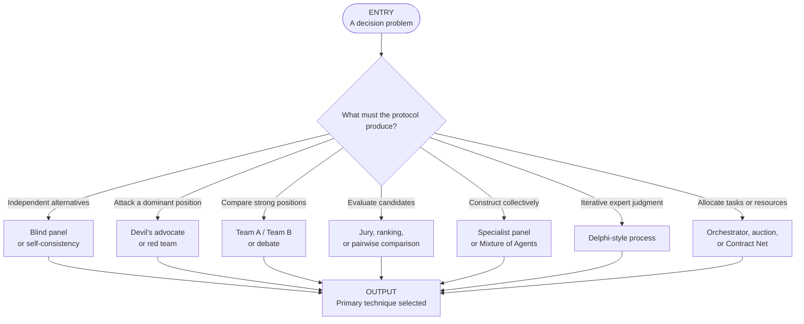

## 5. The design axes

The most useful design move is to configure each axis explicitly rather than copying
an entire named pattern.

### 5.1 Visibility

- **Blind:** agents do not see prior answers. Best for reducing anchoring and social
  convergence.
- **Open:** agents see one another's work. Best for direct correction and synthesis.
- **Blind first, open later:** independent proposals are frozen before a bounded
  rebuttal phase. This is a strong default for consequential decisions.

### 5.2 Relationship

- **Cooperative:** participants jointly improve one solution.
- **Adversarial:** participants search for defects and counterexamples.
- **Competitive:** participants defend different candidates or positions.
- **Mixed:** the protocol changes relationship by phase, such as independent
  generation, adversarial attack, and cooperative repair.

### 5.3 Roles

- **Symmetric peers:** agents have the same task and authority.
- **Asymmetric specialists:** proposer, critic, defender, verifier, classifier,
  adjudicator, executor, or auditor.

Assigning roles is useful only when the roles have different evidence, obligations,
tools, or output contracts. Different theatrical personas using the same context and
instructions do not create meaningful independence.

### 5.4 Model and method diversity

Diversity can come from:

- different model families;
- different prompts or reasoning methods;
- different tools or evidence sources;
- different domain responsibilities;
- different attack surfaces;
- different sampling seeds.

Model-family diversity is helpful when failure modes differ, but model count is not a
substitute for evidence independence. Three models repeating the same incorrect source
still provide one evidence lineage.

### 5.5 Topology

- **Star:** independent reviewers report to one coordinator.
- **Chain:** each participant refines or challenges the previous result.
- **Round table:** every participant can inspect or address every other participant.
- **Tree or layered graph:** intermediate agents aggregate subsets of work.
- **Sparse graph:** agents communicate only along relevant dependencies.

Chains are cheap and easy to understand but amplify early anchoring. Round tables can
surface interactions but are expensive and noisy. Stars preserve independence but put
pressure on the central judge. Layered systems scale, while also risking compounded
summarization loss.

### 5.6 Aggregation

- majority or plurality;
- weighted vote;
- best-of-N;
- ranking or pairwise comparison;
- score against a rubric;
- deterministic verifier;
- argument graph;
- gate or veto catalog;
- judge decision;
- human approval.

Aggregation should match the answer type. Majority is reasonable for a short answer
with an externally checkable truth condition. Complex plans are usually better served
by claim-level verification, pairwise comparisons, or an argument graph.

### 5.7 Authority

A result may be allowed to:

1. **assist** by organizing evidence;
2. **recommend** a decision;
3. **block** a prohibited action;
4. **adjudicate** within a defined contract;
5. **execute** a bounded action;
6. **supervise** a repeated process.

Recommendation, adjudication, and execution are separate authorities. A correct
recommendation does not grant permission to change external state.

### 5.8 Mapping the patterns you were already using

Several intuitive practices that motivated this guide already correspond to formal
design choices:

| Practice | What it is technically | What must still be specified |
|---|---|---|
| Adversarial chains | An adversarial relationship arranged in a serial topology | How early anchoring is controlled; when the chain stops |
| Blind and non-blind adjudication | A visibility policy applied to reviewers or judges | Which identity and prior-answer fields remain hidden, and why |
| Different model families | Model-family diversity | Whether sources, prompts, tools, and failure modes are also independent |
| Main coordinator confronts adversaries on disagreement, then sends the record to a judge | Disagreement-triggered debate followed by separate adjudication | What counts as material disagreement, the round budget, and the judge contract |
| Some agents defend while others only attack | Asymmetric roles in a competitive or mixed protocol | Burden of proof, concessions, falsification criteria, and reward against performative opposition |
| Agents operate as panels | Star, round-table, jury, or specialist-panel topology | Visibility, aggregation, evidence lineage, and authority |
| Agents receive different roles | Heterogeneous specialization | Distinct responsibilities, tools, outputs, and permissions rather than decorative personas |

The key improvement is to stop treating these as complete techniques. Each is one
dimension of a protocol that also needs a frozen objective, evidence rules, budgets,
termination, adjudication, authority, and effect verification.

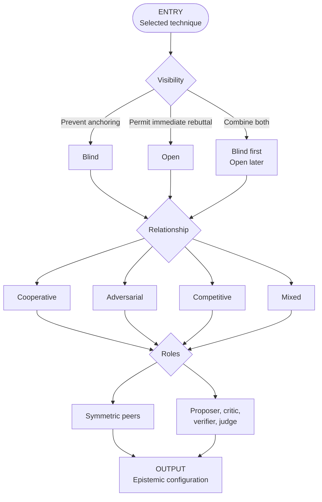

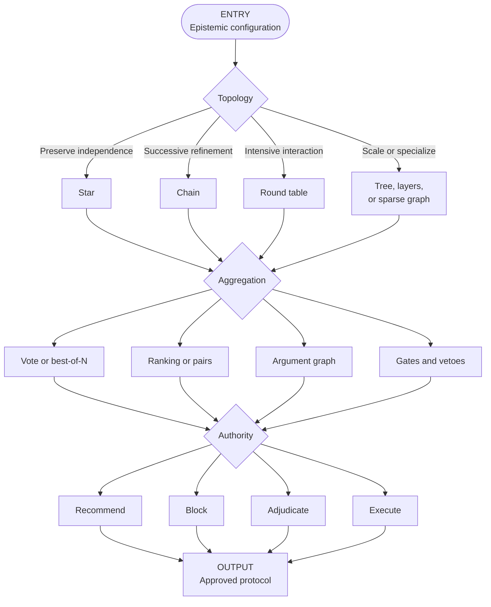

## 6. Roles that create a reliable decision process

### Registrar

Freezes the object under review: version, scope, criteria, evidence surfaces, vetoes,
and authority. Without a registrar function, the author can move the target during
review or the judge can silently change the question.

### Proposer

Produces a candidate answer, plan, diagnosis, or implementation. It must state
assumptions and expose claims that can be tested.

### Critic or adversary

Searches for counterexamples, missing consumers, hidden dependencies, safety
violations, and ways the proposal can produce a false green. A critic is not rewarded
for negativity; it is rewarded for falsifiable findings.

### Defender

Responds to the strongest attacks, narrows overclaims, supplies missing evidence, and
concedes valid defects. Defense is useful when it improves the record, not when it
merely protects the original proposal.

### Verifier

Tests exact predicates with deterministic tools or reproducible checks. The verifier
must distinguish `SUPPORTED`, `REFUTED`, `EXPERT_JUDGMENT`, and `UNVERIFIED`.

### Disagreement classifier

Determines whether a conflict concerns a measurable fact, interpretation, value,
scope, missing evidence, or competing vetoes. It should not be one of the disputing
parties or the final judge.

### Adjudicator

Applies the frozen criteria to the structured claims and evidence. It should be blind
to irrelevant author or model identities and should not erase unresolved dissent.

### Human authority

Resolves policy choices, exceptions, safety-critical ambiguity, or decisions beyond
delegated authority.

### Executor

Applies an authorized decision. It should not be allowed to rewrite the verdict while
executing it.

### Effect verifier

Checks the target environment after execution and proves the expected change. This
role closes the gap between “the action ran” and “the intended effect occurred.”

## 7. The complete adversarial decision protocol

### 7.1 Map of the full journey

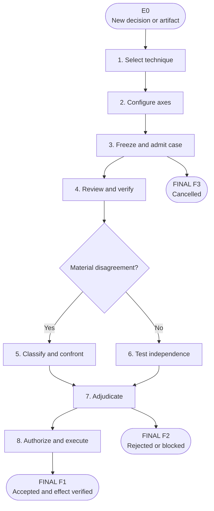

### 7.2 Entry points, pauses, and resumptions

A real workflow does not always start from the beginning. It may resume when a
protocol already exists, evidence arrives, a condition is fulfilled, or a later
incident invalidates the previously observed effect.

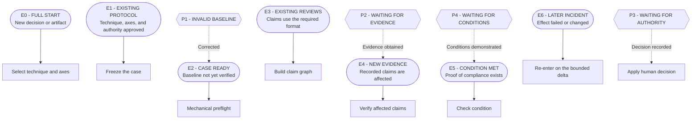

A pause is not a terminal result. Every pause requires a persisted reason, an owner,
a resumption predicate, and an expiry or escalation policy.

### 7.3 Freeze and admit the case

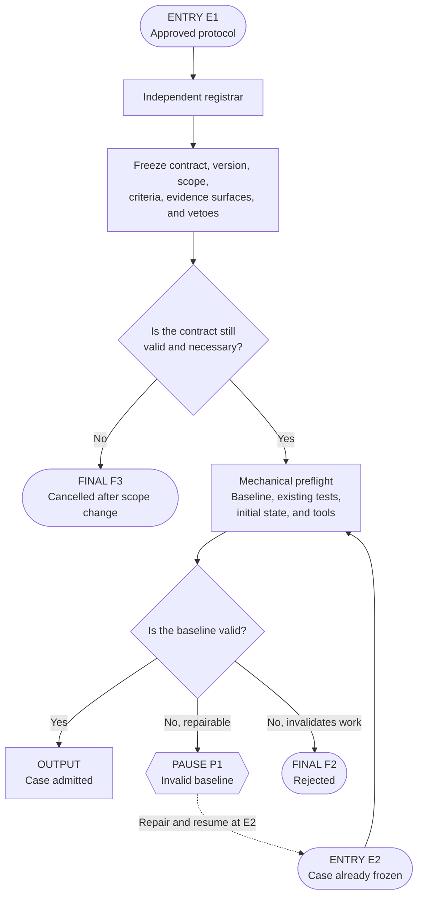

Preflight establishes an interpretable starting point. It does not prove that the
proposal is correct.

### 7.4 Review, normalize, and verify claims

The unit of adjudication should be a traceable claim, not an entire polished report.

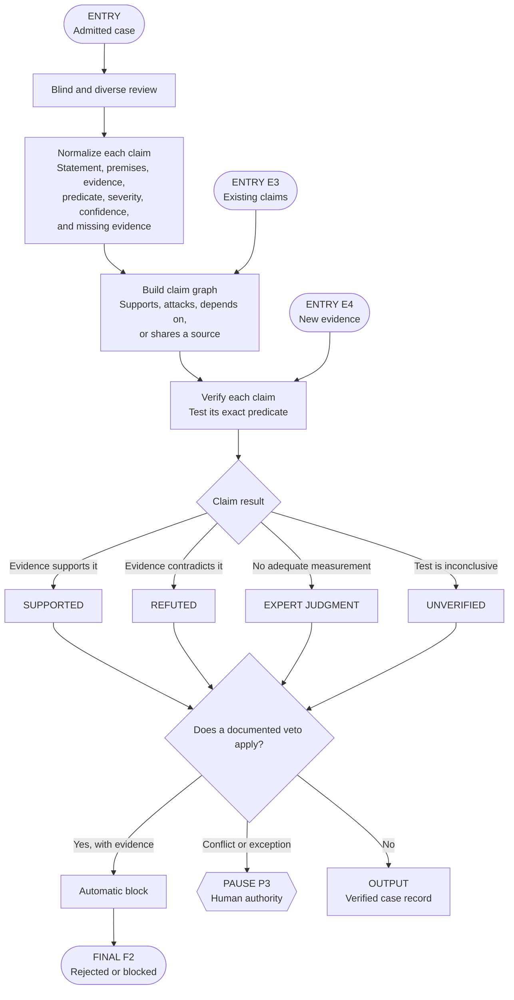

### 7.5 Agreement is not independence

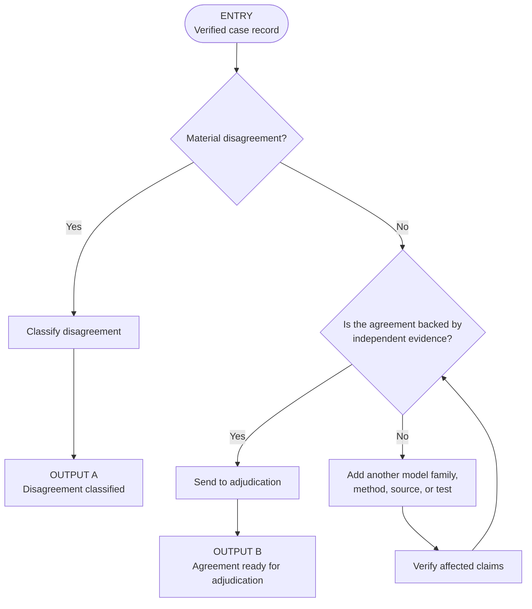

Agreement among agents is weak evidence when they share a model family, prompt,
source, tool, or hidden assumption. Record evidence lineage separately from model
identity.

### 7.6 Classify and treat disagreement

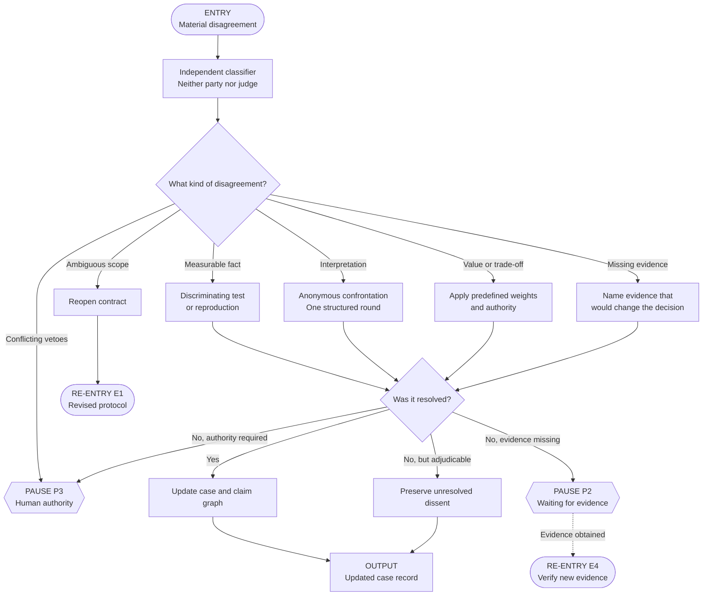

Use confrontation only for interpretive conflicts that can benefit from rebuttal.
Measurable factual disputes should go to a test. Value conflicts require declared
weights or legitimate authority. Missing evidence requires abstention or a pause.

### 7.7 Adjudicate without erasing nuance

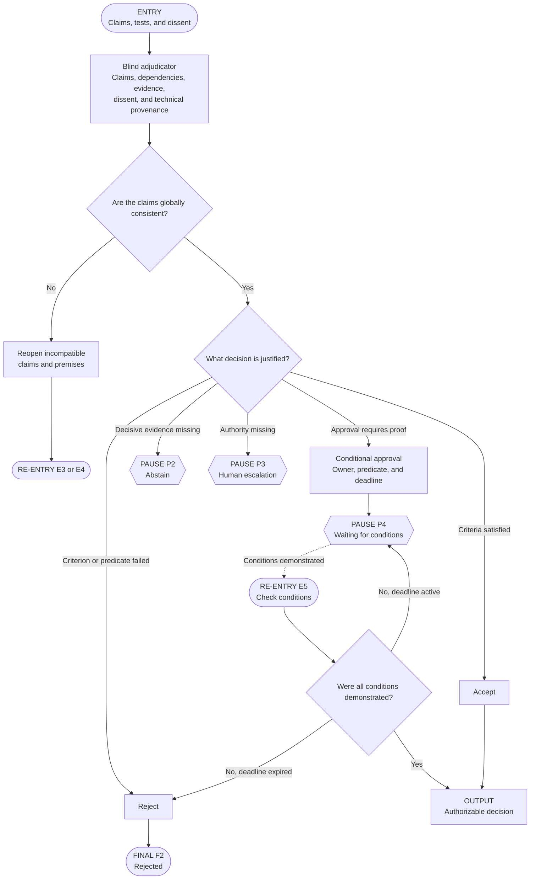

The adjudicator should return more than a winner. A complete decision record includes:

- decision and scope;
- accepted and rejected claims;
- evidence used;
- unresolved dissent;
- confidence and its basis;
- conditions and deadlines;
- vetoes or exceptions;
- authority and required approvals;
- next entry point if the process resumes.

### 7.8 Authorize, execute, and verify the effect

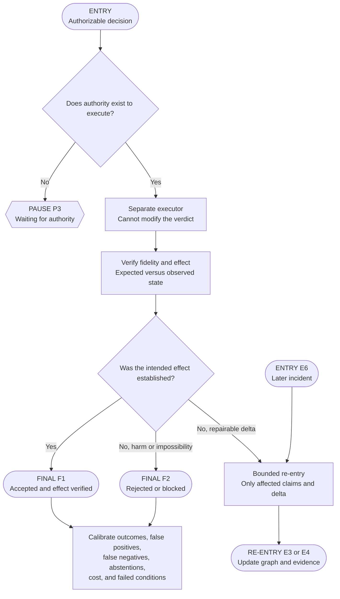

## 8. How to structure the confrontation round

The instruction “confront the adversaries when they disagree” is useful only when the
confrontation has a contract. A practical single-round protocol is:

1. Freeze each initial position before sharing it.
2. Remove irrelevant author and model identity.
3. Give each side the opposing claims, evidence, and predicates.
4. Require each side to identify:
   - the strongest opposing claim;
   - the exact point of disagreement;
   - evidence that would falsify its own position;
   - claims it concedes;
   - claims that remain unsupported.
5. Permit one rebuttal and one response, or another explicitly bounded budget.
6. Send the resulting claim deltas to verification.
7. Preserve unresolved dissent for the judge.

Additional rounds are justified only when they produce new evidence, narrow a claim,
or change a verifiable state. A loop that repeats rhetoric without a progress signal
should terminate.

## 9. Claim contracts and evidence lineage

A normalized claim can use this minimal structure:

```yaml
claim:
  id: C-017
  statement: "The proposed control prevents duplicate settlement."
  author_role: adversarial_reviewer
  premises:
    - "All write paths pass through the idempotency boundary."
  predicate: "Two concurrent requests produce at most one settlement."
  evidence:
    - source: integration_test
      locator: tests/payments/test_concurrent_settlement.py
      authority: primary
  evidence_lineage:
    model_family: family_b
    method: negative_concurrency_test
    shared_sources: []
  severity: critical
  confidence: medium
  missing_evidence:
    - "Production-equivalent database isolation test"
  status: UNVERIFIED
```

The evidence lineage is essential. Model diversity, source diversity, and method
diversity are different properties. They should not be collapsed into a single
“independent” flag.

## 10. The adjudicator contract

```yaml
adjudicator:
  responsibility: "Apply the frozen decision contract to verified claims."
  may:
    - accept
    - reject
    - conditionally_accept
    - abstain
    - escalate
  may_not:
    - silently_change_scope
    - invent_missing_evidence
    - infer_truth_from_majority_alone
    - execute_the_decision
  inputs:
    - frozen_contract
    - normalized_claims
    - verification_results
    - dependency_graph
    - veto_results
    - unresolved_dissent
  output:
    - decision
    - rationale_by_criterion
    - accepted_and_rejected_claims
    - conditions
    - residual_risk
    - required_authority
    - resumption_entry_point
```

Blind adjudication should conceal irrelevant identity, not relevant provenance. The
judge may need to know that a claim came from a deterministic test, a primary source,
or expert judgment. It usually does not need to know that the prose was written by a
famous model or the original author.

## 11. Choosing the adjudication mechanism

### Majority

Use when outputs are commensurable, agents are sufficiently independent, and the
answer has an external truth condition. Do not use majority to settle safety vetoes,
value disputes, or correlated factual errors.

### Weighted vote

Use when competencies are measured and weights are set before seeing the current
answers. Post-hoc weights invite outcome manipulation.

### Best-of-N

Use when candidate generation is cheap and a reliable scorer or verifier exists.

### Ranking or pairwise comparison

Use for several complex alternatives. Randomize order, repeat reversed comparisons,
and check transitivity because LLM judges can exhibit position, verbosity, and
self-preference biases.

### Argument graph

Use when the decision depends on interacting claims, shared premises, and explicit
attacks or defenses. It is more expensive than voting but preserves structure and
minority evidence.

### Gates and vetoes

Use for hard safety, policy, or contractual predicates. A veto must identify its
class, evidence, scope, and any authorized exception process.

### Human adjudication

Use when the decision includes legitimate value choices, missing delegated authority,
irreversible consequences, regulatory duties, or conflicts among hard rules.

## 12. Common designs and when to use them

### Low-cost factual decision

```text
Generate N independent answers
-> deterministic check where possible
-> majority or best-of-N
-> abstain on unresolved conflict
```

### Technical design review

```text
Freeze design and criteria
-> blind reviewers from different methods or families
-> normalize claims
-> verify exact predicates
-> one confrontation round for interpretive disputes
-> blind adjudicator
-> human approval if authority is retained
```

### High-risk implementation or operational change

```text
Preflight and baseline
-> independent implementation evidence
-> adversarial negative testing
-> claim graph and veto catalog
-> adjudication with conditions or abstention
-> explicit authorization
-> separate execution
-> observed-effect verification
-> calibration and incident re-entry
```

### Open-ended research synthesis

```text
Independent source collection
-> specialist panels
-> provenance and source-quality checks
-> claim-level synthesis
-> dissent register
-> editorial adjudication
```

## 13. Failure modes and safeguards

| Failure mode | Why it happens | Safeguard |
|---|---|---|
| Correlated consensus | Same model, prompt, or source | Track evidence lineage; add a new method or source |
| Anchoring | Later agents see the first answer | Blind generation before discussion |
| Sycophancy | Agents converge toward confident peers | Anonymous claims; explicit permission to disagree |
| Performative adversarialism | Critic must always find a defect | Reward falsifiable claims and valid `NO ISSUE` results |
| Debate degeneration | Repeated rounds add rhetoric, not evidence | Progress signal and round budget |
| Judge bias | Position, length, style, or identity affects verdict | Blind and randomize; reverse pair order; use rubric |
| Evidence laundering | Repetition makes a weak source appear independent | Preserve source lineage and shared premises |
| False green | A proxy test does not prove the claim | Verify the exact predicate and target surface |
| Scope drift | Contract changes during review | Independent registrar and versioned case |
| Authority collapse | Judge also executes | Separate verdict, authorization, and execution |
| Forced certainty | System cannot admit missing evidence | `UNVERIFIED`, abstention, pause, and escalation |
| Lost minority signal | Aggregation discards a valid dissent | Persist unresolved claims and their evidence |
| Conditional approval without enforcement | Conditions are vague | Owner, predicate, deadline, verifier, consequence |
| Successful execution mistaken for success | Tool call finished but effect failed | Compare expected and observed environment state |

## 14. Evaluation and calibration

Evaluate the protocol against a strong single-agent baseline and under an equivalent
budget. Otherwise, additional agents receive more tokens, time, and tool calls, and
the comparison does not isolate the value of coordination.

Track at least:

- task accuracy or decision quality;
- false-positive and false-negative rates;
- defect discovery and defect survival rates;
- calibration of confidence and abstention;
- inter-judge agreement;
- reversal rate after new evidence;
- unresolved-dissent rate;
- veto precision and exception frequency;
- latency, tokens, monetary cost, and tool calls;
- human escalation rate and resolution time;
- execution fidelity;
- observed-effect success rate;
- incident rate after an apparently successful decision.

### Minimum evaluation set

1. **Normal case:** valid evidence and one defensible answer.
2. **Boundary case:** two plausible positions with a subtle dependency.
3. **Missing-evidence case:** the correct output is abstention or a pause.
4. **Correlated-error case:** several agents repeat the same false premise.
5. **Adversarial case:** a persuasive but false proposal competes with a terse,
   well-supported one.
6. **Authority case:** the answer is clear, but execution is not authorized.
7. **Effect-failure case:** execution completes while the target state remains wrong.

## 15. Three levels of protocol

### Minimal

Use for reversible, low-impact work:

- two or three independent candidates;
- one rubric or deterministic check;
- one selector;
- explicit uncertainty.

### Standard

Use for important recommendations and technical reviews:

- frozen contract;
- blind diverse review;
- normalized claims;
- verification by claim;
- one bounded confrontation round;
- separate adjudicator;
- abstention and dissent record.

### High consequence

Use for irreversible, safety-sensitive, regulated, or externally acting systems:

- all standard controls;
- explicit evidence authority and freshness;
- hard gates and veto catalog;
- human authority boundaries;
- idempotent, permission-bounded execution;
- effect verification and rollback or containment plan;
- durable audit artifacts;
- ongoing calibration and incident re-entry.

## 16. A practical build checklist

### Objective and authority

- What observable decision or effect is required?
- Who owns the decision?
- What may agents recommend, block, adjudicate, or execute?
- What is explicitly out of scope?

### Evidence

- Which sources are primary, derived, or advisory?
- What is the freshness limit?
- What happens when sources conflict or evidence is missing?
- Which claims can be tested deterministically?

### Technique and axes

- Why is a panel, debate, red team, jury, or allocation protocol appropriate?
- Is the first pass blind?
- Are roles symmetric or asymmetric?
- Are model, method, and source diversity real?
- What topology and aggregation rule are used?

### Claims and disagreement

- Does every material claim have a predicate?
- Are dependencies and shared sources recorded?
- Is disagreement classified before debate?
- What evidence would change each side's position?

### Loops

- What is the purpose of each round?
- What counts as progress?
- What are the round, token, time, and monetary budgets?
- When does the process abstain or escalate?

### Adjudication

- Is the judge independent of the disputing roles?
- Is irrelevant identity hidden?
- Are vetoes, conditions, dissent, and uncertainty preserved?
- Can the judge alter scope or execute? It usually should not.

### Execution and verification

- Who authorizes external action?
- Is execution bounded and recoverable?
- What artifact proves what was executed?
- What observation proves the intended effect?
- Which entry point handles a later incident?

## 17. How the multi-model review informed this guide

Earlier versions of this framework were challenged through separate reviews using
Fable, Grok, and Astra. The useful result was not that three model families “agreed.”
The useful result was the pressure to make the protocol explicit:

- separate technique selection from configuration axes;
- preserve blind generation before confrontation;
- classify disagreement before choosing a remedy;
- separate claims, evidence, and argument provenance;
- distinguish agreement from independent confirmation;
- make abstention, pauses, conditions, and human escalation first-class outcomes;
- separate adjudication from execution;
- verify the observed effect rather than the completion signal.

Cross-model convergence is process evidence, not proof. The framework deliberately
requires independent sources, methods, and executable checks because model families
can still share training data, conventions, blind spots, and persuasive failure modes.

## 18. Final principles

1. More agents do not automatically create more truth.
2. Independence must be measured at the level of evidence and method, not just model
   names.
3. Produce independent positions before allowing social interaction.
4. Debate interpretations; test measurable facts.
5. Convert prose into claims with predicates and evidence.
6. Preserve minority evidence and unresolved dissent.
7. Make abstention and conditional approval legitimate outcomes.
8. Keep the contract, judge, authority, executor, and effect verifier distinct.
9. Bound every round by progress, cost, and exit conditions.
10. The successful terminal state is not “the agents agreed.” It is “the justified
    decision was authorized, faithfully executed, and its intended effect was
    observed.”

## References

- Reid G. Smith, [The Contract Net Protocol: High-Level Communication and Control in
  a Distributed Problem Solver](https://ieeexplore.ieee.org/document/1675516), 1980.
- Norman Dalkey, Bernice Brown, and Samuel Cochran, [The Delphi Method: An
  Experimental Study of Group Opinion](https://www.rand.org/pubs/research_memoranda/RM5888.html),
  1969.
- Phan Minh Dung, [On the Acceptability of Arguments and Its Fundamental Role in
  Nonmonotonic Reasoning, Logic Programming and N-Person Games](https://doi.org/10.1016/0004-3702(94)00041-X),
  1995.
- Xuezhi Wang et al., [Self-Consistency Improves Chain of Thought Reasoning in
  Language Models](https://arxiv.org/abs/2203.11171), 2022.
- Yilun Du et al., [Improving Factuality and Reasoning in Language Models through
  Multiagent Debate](https://arxiv.org/abs/2305.14325), 2023.
- Tian Liang et al., [Encouraging Divergent Thinking in Large Language Models through
  Multi-Agent Debate](https://arxiv.org/abs/2305.19118), 2023.
- Lianmin Zheng et al., [Judging LLM-as-a-Judge with MT-Bench and Chatbot
  Arena](https://arxiv.org/abs/2306.05685), 2023.
- Chi-Min Chan et al., [ChatEval: Towards Better LLM-based Evaluators through
  Multi-Agent Debate](https://arxiv.org/abs/2308.07201), 2023.
- Andries Smit et al., [Should We Be Going MAD? A Look at Multi-Agent Debate
  Strategies for LLMs](https://openreview.net/forum?id=CrUmgUaAQp), 2024.
- Junlin Wang et al., [Mixture-of-Agents Enhances Large Language Model
  Capabilities](https://arxiv.org/abs/2406.04692), 2024.
- Zachary Kenton et al., [On Scalable Oversight with Weak LLMs Judging Strong
  LLMs](https://arxiv.org/abs/2407.04622), 2024.
- Wenzhe Li et al., [Rethinking Mixture-of-Agents: Is Mixing Different Large Language
  Models Beneficial?](https://arxiv.org/abs/2502.00674), 2025.
