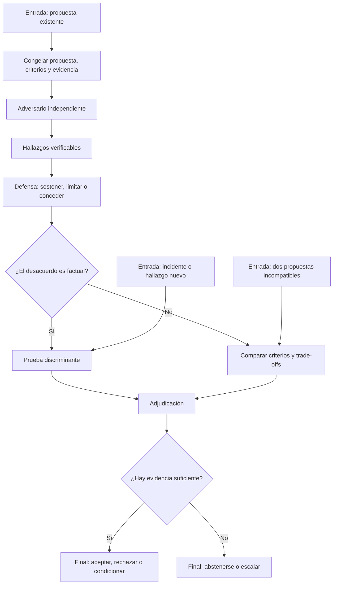

# Análisis adversarial con inteligencia artificial

## Cómo dejar de aceptar la primera respuesta como decisión final

## Resumen ejecutivo

Esta guía está dirigida a profesionales técnicos que ya utilizan inteligencia
artificial con soltura. El problema que aborda no es cómo adoptar IA ni cómo construir
agentes. Es cómo evitar que una única respuesta plausible determine una decisión sin
haber sido cuestionada.

La regla central es:

> **La primera respuesta es una propuesta. No es la decisión.**

El análisis adversarial introduce oposición deliberada antes de aceptar una conclusión.
Una segunda instancia intenta refutar la propuesta, otra comprueba las afirmaciones en
disputa y, cuando corresponde, una función separada adjudica el resultado. El propósito
no es crear discusión: es detectar errores que una revisión confirmatoria no buscaría.

## El problema: decisión de una sola pasada

El patrón habitual es:

```text
Pregunta -> respuesta convincente -> aceptación
```

Este patrón concentra en una sola respuesta cuatro funciones incompatibles:

- proponer una solución;
- identificar sus propios defectos;
- decidir qué evidencia es suficiente;
- emitir el veredicto final.

La fluidez, el detalle y la seguridad verbal pueden confundirse con calidad. Pedir
«revisa tu respuesta» reduce algunos errores, pero mantiene el mismo contexto, los
mismos supuestos y el mismo anclaje inicial.

El patrón adversarial separa funciones:

```text
Propuesta -> ataque -> respuesta al ataque -> prueba -> adjudicación
```

No todos los casos necesitan todas las fases. El nivel de oposición debe corresponder
al impacto, la incertidumbre y la reversibilidad de la decisión.

## Protocolo adversarial mínimo

Para decisiones técnicas relevantes, utilice como mínimo:

1. **Propuesta congelada.** Registre la respuesta original antes de mostrar críticas.
2. **Ataque independiente.** Solicite contraejemplos, supuestos ocultos y modos de fallo.
3. **Respuesta estructurada.** El proponente debe defender, limitar o retirar cada
   afirmación cuestionada.
4. **Prueba discriminante.** Resuelva desacuerdos factuales con código, fuentes,
   experimentos o inspección directa.
5. **Decisión separada.** Acepte, rechace, condicione o declare evidencia insuficiente.



## Técnicas adversariales

### 1. Autocrítica dirigida

La misma IA revisa su primera respuesta con instrucciones específicas.

**Úsela para:** decisiones de bajo impacto, borradores y comprobaciones rápidas.

**Instrucción mínima:**

```text
Trata la respuesta anterior como una propuesta ajena. Identifica el supuesto más
frágil, un contraejemplo, una condición que cambiaría la conclusión y una afirmación
que necesita verificación externa. No reescribas la propuesta todavía.
```

**Límite:** el crítico comparte el anclaje y los errores de contexto del proponente.
No constituye una revisión independiente.

### 2. Revisión adversarial ciega

Un segundo revisor recibe el problema y la propuesta congelada, pero no la identidad,
justificación posterior ni conclusión de otros revisores.

**Úsela para:** código, arquitectura, investigación, contratos técnicos y decisiones
con impacto moderado o alto.

**Ventaja:** reduce deferencia, contaminación y convergencia prematura.

**Exija:** hallazgos falsificables, consecuencia, evidencia y prueba necesaria.

### 3. Ataque y defensa

Un adversario ataca afirmaciones concretas y el proponente responde punto por punto.
La defensa puede sostener, limitar o conceder; no está obligada a preservar la propuesta
original.

**Úsela para:** distinguir defectos reales de objeciones superficiales.

**Regla:** no permita alegatos generales. Cada parte debe referirse al mismo ID de
afirmación y a la misma evidencia.

### 4. Defensores de alternativas

Cada participante defiende una opción diferente bajo criterios comunes. Un comparador
posterior evalúa los argumentos sin conocer la identidad del autor.

**Úsela para:** comparar arquitecturas, proveedores, estrategias o planes de migración.

**Riesgo:** si cada defensor usa criterios distintos, el resultado será retórico. Fije
antes los criterios, vetos y trade-offs aceptables.

### 5. Panel de especialistas

Varios revisores examinan la misma propuesta desde responsabilidades distintas:
seguridad, fiabilidad, coste, operación, datos o experiencia de usuario.

**Úsela para:** ampliar cobertura cuando ningún revisor domina todo el problema.

**No lo confunda con:** una votación. Tres opiniones dependientes no equivalen a tres
líneas de evidencia.

### 6. Cadena adversarial

La salida de una etapa pasa a la siguiente: propuesta, crítica, defensa, verificación y
decisión.

**Úsela para:** procesos donde cada fase necesita el resultado normalizado de la
anterior.

**Riesgo:** los errores tempranos se propagan. Congele las entradas, conserve el texto
original y permita reingresar en la fase donde apareció evidencia nueva.

### 7. Confrontación con adjudicador

Cuando adversario y defensor mantienen un desacuerdo, una función separada decide con
criterios previamente definidos.

**Úsela para:** controversias donde ya existen argumentos suficientes y la decisión no
puede tomarse por una prueba factual aislada.

**El adjudicador puede:** aceptar, rechazar, aceptar con condiciones, abstenerse o
escalar. No debe inventar una certeza que el expediente no contiene.

### 8. Prueba de falsación

En lugar de pedir otra opinión, se diseña una prueba que produciría resultados distintos
según cuál afirmación sea correcta.

**Úsela para:** rendimiento, comportamiento de código, seguridad, compatibilidad,
exactitud de datos y afirmaciones documentales.

**Prioridad:** cuando una disputa puede resolverse con una prueba, la prueba tiene más
valor que otra ronda de debate.

## Ejes de configuración

Las técnicas anteriores pueden combinarse. Estas decisiones cambian el comportamiento
del proceso:

| Eje | Opción | Cuándo conviene |
|---|---|---|
| Visibilidad | Ciego | Evitar anclaje, deferencia o imitación |
| Visibilidad | No ciego | Refutar una propuesta específica |
| Relación | Simétrica | Comparar alternativas con la misma carga de prueba |
| Relación | Asimétrica | Someter una propuesta a una prueba más exigente |
| Secuencia | Paralela | Obtener opiniones independientes |
| Secuencia | Encadenada | Refinar y comprobar hallazgos sucesivos |
| Rol | Ataque únicamente | Maximizar descubrimiento de fallos |
| Rol | Ataque y defensa | Examinar si los hallazgos sobreviven contradicción |
| Composición | Misma familia de modelo | Reducir coste y medir consistencia |
| Composición | Familias diferentes | Aumentar diversidad de entrenamiento y comportamiento |
| Evidencia | Compartida | Debatir la interpretación de un expediente común |
| Evidencia | Separada | Detectar dependencia de fuentes o contexto |
| Decisión | Votación | Preferencias simples y errores aproximadamente independientes |
| Decisión | Adjudicación | Evidencia desigual, vetos, matices o consecuencias distintas |

Cambiar de familia de modelo puede aumentar la diversidad, pero no demuestra
independencia. Dos modelos que repiten la misma fuente, premisa o error aportan una sola
línea de evidencia.

## Cómo tratar los desacuerdos

Antes de confrontar a los participantes, clasifique el desacuerdo:

| Tipo | Tratamiento |
|---|---|
| Hecho verificable | Ejecutar una prueba o consultar una fuente primaria |
| Interpretación | Comparar qué explicación cubre mejor la evidencia |
| Alcance | Volver al objeto y a las exclusiones acordadas |
| Criterio o valor | Aplicar pesos, vetos o autoridad humana |
| Evidencia ausente | Abstenerse, buscar evidencia o escalar |
| Ambigüedad verbal | Normalizar la afirmación antes de continuar |

La confrontación sólo debe continuar si una nueva ronda aporta evidencia, modifica una
afirmación o reduce una incertidumbre identificable. Repetir argumentos no constituye
progreso.

## Formatos operativos

### Hallazgo adversarial

```text
ID:
Afirmación atacada:
Modo de fallo o contraejemplo:
Consecuencia:
Evidencia disponible:
Prueba que resolvería el punto:
Estado: SOSTENIDO | REFUTADO | NO VERIFICADO
```

### Respuesta del defensor

```text
ID del hallazgo:
Respuesta: SOSTENER | LIMITAR | CONCEDER
Evidencia:
Alcance revisado de la afirmación:
Riesgo residual:
```

### Decisión del adjudicador

```text
Decisión: ACEPTAR | RECHAZAR | CONDICIONAR | ABSTENERSE | ESCALAR
Afirmaciones determinantes:
Evidencia determinante:
Disenso que permanece:
Condiciones y responsable:
Qué evidencia cambiaría la decisión:
```

## Niveles de rigor adversarial

Los niveles indican cuánto control adversarial aplica una persona o equipo. No describen
la adopción general de IA ni requieren construir una plataforma multiagente.

### Nivel 0: primera respuesta

La respuesta inicial se acepta o se edita sin oposición formal. Es apropiado sólo para
tareas reversibles y de baja consecuencia.

### Nivel 1: autocrítica dirigida

La propuesta recibe una revisión crítica separada, aunque proceda del mismo modelo. El
usuario exige supuestos, contraejemplos y puntos no verificados.

### Nivel 2: adversario independiente

Un segundo revisor, preferiblemente ciego, intenta refutar la propuesta. Las diferencias
se registran antes de que los participantes vean las demás respuestas.

### Nivel 3: ataque, defensa y prueba

Los hallazgos se normalizan; el proponente responde; los desacuerdos factuales se envían
a pruebas discriminantes. Ninguna parte gana por insistencia o volumen de texto.

### Nivel 4: adjudicación separada

Un adjudicador evalúa el expediente con criterios congelados y puede conservar disenso,
imponer condiciones o abstenerse. La mayoría no sustituye a la evidencia.

### Nivel 5: práctica adversarial calibrada

El equipo selecciona la técnica según el riesgo, mide qué adversarios detectan defectos
reales y ajusta modelos, roles, rondas y umbrales con resultados observados.

El objetivo no es llevar todas las tareas al nivel 5. Es evitar el nivel 0 cuando una
decisión merece oposición independiente.

## Selección rápida

| Situación | Configuración recomendada |
|---|---|
| Borrador reversible | Primera respuesta + autocrítica dirigida |
| Revisión de código | Propuesta congelada + adversario ciego + prueba |
| Comparación de dos diseños | Defensor por opción + comparación ciega |
| Arquitectura de alto impacto | Panel especializado + adversario transversal + adjudicador |
| Investigación con fuentes en conflicto | Revisores independientes + verificación de fuentes |
| Seguridad o abuso | Red team asimétrico + verificación de rutas de ataque |
| Desacuerdo factual | Prueba discriminante; detener el debate |
| Trade-off no resoluble por hechos | Adjudicación con criterios y autoridad humana |

## Prácticas que parecen adversariales, pero no lo son

- Pedir cinco respuestas en el mismo contexto después de mostrar la primera.
- Contar votos sin comprobar independencia ni calidad de evidencia.
- Ordenar al crítico que encuentre obligatoriamente un defecto.
- Premiar al adversario por cantidad de objeciones.
- Permitir que el proponente redacte también el veredicto.
- Usar un juez sin criterios previos o conociendo identidades irrelevantes.
- Continuar rondas hasta obtener consenso.
- Confundir desacuerdo verbal con evidencia nueva.
- Presentar como resuelto lo que debería quedar `NO VERIFICADO`.

## Cambio mínimo de práctica

Para dejar de delegar la decisión en la primera respuesta, aplique esta secuencia a una
tarea técnica que ya realiza con IA:

1. Guarde la primera respuesta sin modificarla.
2. Abra una revisión independiente y solicite sólo ataques verificables.
3. Exija una respuesta punto por punto del proponente.
4. Pruebe las afirmaciones que determinen la decisión.
5. Emita el veredicto desde un contexto separado y permita la abstención.

Este cambio puede ejecutarse manualmente con varias conversaciones. La automatización
es opcional; la separación de funciones y evidencia es lo esencial.

## Checklist antes de aceptar una respuesta

- [ ] La respuesta inicial se trata como propuesta, no como veredicto.
- [ ] Existe al menos una búsqueda explícita de contraejemplos o modos de fallo.
- [ ] El adversario no fue anclado innecesariamente por otras opiniones.
- [ ] Cada objeción importante identifica una afirmación y una consecuencia.
- [ ] Los desacuerdos factuales se resolvieron mediante pruebas cuando fue posible.
- [ ] La defensa pudo limitar o conceder, no sólo justificar.
- [ ] El decisor está separado de quienes defendieron las posiciones.
- [ ] El resultado conserva condiciones, disenso e incertidumbre.
- [ ] La abstención o el escalamiento siguen disponibles.

## Regla de referencia

> **Proponer no es decidir. Atacar no es verificar. Votar no es adjudicar.**

## Documento técnico completo

La [guía técnica completa](./README.md) desarrolla las familias clásicas y emergentes,
los ejes de configuración, los contratos de afirmaciones y adjudicadores, los diagramas
del flujo, las métricas y las referencias académicas.
